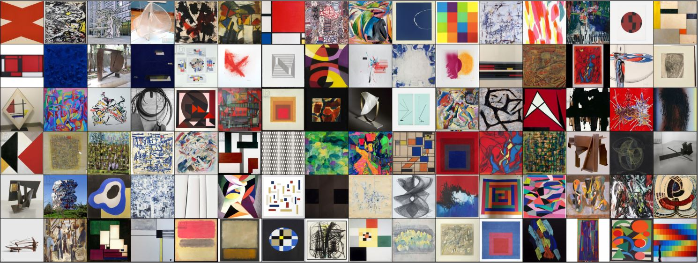

# The DELAUNAY dataset for psychophysical and machine learning experiments

### CONTENTS

The dataset comprises 11,503 images from 53 categories, i.e. artists (mean number of images per artist: 217.04; standard deviation: 58.55), along with the associated URLs.
